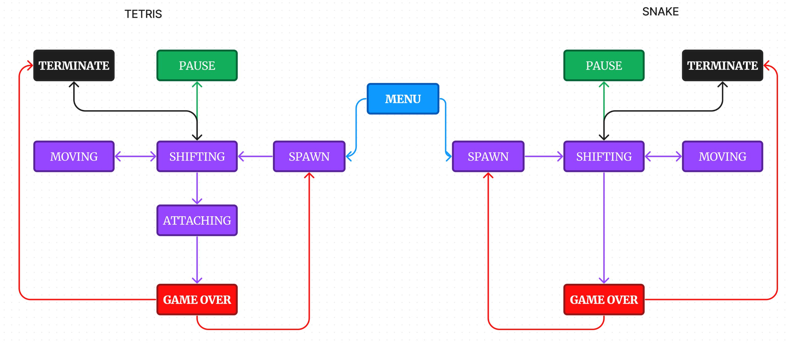

# BrickGame Змейка
Реализация игры «Змейка» на языке программирования С++ в парадигме объектно-ориентированного программирования.

### Конечный автомат

Для формализации логики данной игры можно представить следующий вариант конечного автомата:

<!--  -->

Данный КА состоит из следующих состояний:

- Старт — состояние, в котором игра ждет, пока игрок нажмет кнопку готовности к игре.
- Спавн — состояние, в которое переходит игра при создании очередного "яблока".
- Перемещение — основное игровое состояние с обработкой ввода от пользователя — поворот змейки.
- Сдвиг — состояние, в которое переходит игра после истечения таймера. В нем змейка перемещается на одну клетку вперед.
- Пауза - приостановка игрового процесса
- Игра окончена — игра окончена.
- Прерывание - завершение работы программы.

### Информация

- Программаразработана на языке C++ стандарта C++17.
- Программа состоит из двух частей: библиотеки, реализующей логику игры змейка, и десктопного интерфейса.
- Для формализации логики игры использован конечный автомат.
- Библиотека имеет функцию, принимающая на вход ввод пользователя, и функцию, выдающую матрицу, которая описывает текущее состояние игрового поля, при каждом ее изменении.
- Код библиотеки программы находится в папке src/brick_game/snake.
- Код с интерфейсом программы находится в папке src/gui/desktop.
- Классы реализованы внутри пространства имен `s21`.
- Сборка программы должна быть настроена с помощью Makefile со стандартным набором целей для GNU-программ: all, install, uninstall, clean, dvi, dist, tests. Установка должна вестись в любой другой произвольный каталог.
- Реализация с графическим пользовательским интерфейсом, на базе Q.
- Программа реализована с использованием паттерна MVC, а также:
  - нет кода бизнес-логики в коде представлений;
  - нет кода интерфейса в контроллере и в модели;
  - контроллер является тонким.
- Десктопный интерфейс должен поддерживает игру из проекта BrickGame v1.0.
- Консольный интерфейс должен поддерживает змейку.

### Управление и игровое поле

- В игре змейка присутствуют следующие механики:
  - Змейка передвигается по полю самостоятельно, на один блок вперед по истечении игрового таймера.
  - Когда змейка сталкивается с «яблоком», ее длина увеличивается на один.
  - Когда длина змейки достигает 200 единиц, игра заканчивается победой игрока.
  - Когда змейка сталкивается с границей поля или сама с собой, игра заканчивается поражением игрока.
  - Пользователь может менять направление движение змейки с помощью стрелок, при этом змейка может поворачивать только налево и направо относительно текущего направления движения.
  - Выход из игры осуществляется с помощью нажатия клавиши 'q'.
  - Пользователь может ускорять движение змейки зажатием клавиши действие.
- Начальная длина змейки равна четырем «пикселям».
- Игровое поле имеет размер 10 «пикселей» в ширину и 20 «пикселей» в высоту.
- Подготовь для сдачи проекта диаграмму, отображающую все состояния и переходы между ними для реализованного КА.

### Уровни

В игре реализованы следующие механики:

- подсчет очков;
- хранение максимального количества очков.

Данная информация передается и выводится пользовательским интерфейсом в боковой панели. Максимальное количество очков хранится в файле и сохраняется между запусками программы.

Максимальное количество очков изменяется во время игры, если пользователь во время игры превышает текущий показатель максимального количества набранных очков.

Начисление очков будет происходить следующим образом: при поедании очередного «яблока» добавляется одно очко.

Каждый раз, когда игрок набирает 5 очков, уровень увеличивается на 1. Повышение уровня увеличивает скорость движения змейки. Максимальное количество уровней — 10.

### Build

Сборка программы настроена с помощью Makefile

* `make install` - Сборка программы BrickGame_v2.0
* `make unistall` - Удаление программы
* `make dvi` - Компиляция LaTex файла с описанием проекта
* `make dist` - Архивирование проекта
* `make test` - Покрытие unit-тестами функций вычисления c помощью библиотеки Check
* `make gcov_report` - Формирование отчёта gcov в виде html страницы
* `make style` - форматирование
* `make clang-format` - Проверка кода на Google style
* `make clean` - Удаление ненужных файлов
